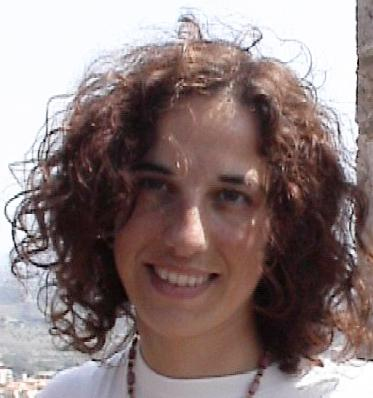
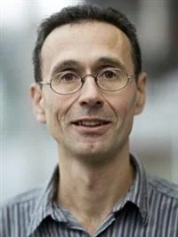



## Teachers

### Claudia Archetti

Claudia Archetti is Full Professor of Operations Research at ESSEC Business School, France. She is member of the Operations Management & Operations Research (OMOR) Research Cluster. From September 2022, she is Associate Dean of Chairs at ESSEC.

She teaches Decision Analytics, Optimimization for Decision Making, Introduction to Optimization and Math Refresher in ESSEC MSc and PhD programs. Prior to joining ESSEC in 2019, she was appointed at the University of Brescia as Assistant Professor in 2005 and as Associate Professor in 2014.

Her research interests include models and algorithms for vehicle routing problems; mixed integer mathematical programming models for the minimization of the sum of inventory and transportation costs in logistic networks; exact and heuristic algorithms for supply-chain management; reoptimization of combinatorial optimization problems.

Claudia Archetti has carried out the scientific activity in collaboration with Italian and foreign colleagues and published joint papers with some of the best researchers at the international level.

She is author of more than 100 papers in international journals. She was EURO VIP 3, in charge on piblications and communication. She was Area Editor of Computers and Operations Research. She is co-Editor in Chief of Networks and member of the Editorial Board of European Journal of Operational Research and EURO Journal on Computational Optimizartion.

### Michel Bierlaire

Michel Bierlaire is a professor at EPFL (École Polytechnique Fédérale de Lausanne) and the head of the Transport and Mobility Laboratory.

He received a PhD in mathematics from University of Namur in 1996 and then joined as a research associate the Intelligent Transportation Systems Program at the Massachusetts Institute of Technology.
In 1998, he joined EPFL as a senior scientist at the Operations Research Group at the Institute of Mathematics.
In 2006, he was made associate professor at the EPFL's School of Architecture, Civil and Environmental Engineering and became the founding director of the Transport and Mobility Laboratory.
Since 2012, he has been a full professor at the EPFL, where he created in 2010 the Doctoral Program in Civil and Environmental Engineering, that he chaired until 2017.
In 2012, Michel founded hEART, the European Association for Research in Transportation that he chaired from 2012 to 2015.

Michel's research targets at developing mathematical models replicating the complexity of mobility behavior of individuals and goods for all modes of transportation.
He aims to develop solutions to transportation problems that also include the implications of mobility on land use, economics, and the environment.
His work focuses on modeling travel behaviors by employing choice and activity-based models; on developing operations research models based on vehicle routing, scheduling, and timetabling; and on the fusion of those models. His further interests encompass intelligent transportation systems and the reproduction of pedestrian flow patterns.

He creates and tests mathematical models and algorithms for applications in operations research that include continuous and discrete optimization, queuing theory, graphs, and simulation.
Apart from implementations in transportation demand analysis, his work also finds active use in other domains such as marketing and image analysis.
His multidisciplinary research draws next to mathematics also on computer vision, image analysis, hospital management and marketing.

### Elena Fernández

Elena Fernández is full professor of Operational Research at the University of Cadiz in Spain.
After her Master's in mathematics at the University of Zaragoza, she obtained her PhD in computer science at the Polythecnical University of Catalonia.
She worked at the University of the Basque Country and later was associate and then full professor at the Polytechincal University of Catalonia.
She moved to the University of Cadiz in 2019.

Her research spans a wide range of topics: location analysis, network design, and vehicle routing are the most prominent.
She worked extensively with exact and heuristic methods, and has published more than a hundred paper that received more than five thousand citations.

She is also very active in the national and European O.R. communities: she was president of EURO, and director of the scientific committee of the Spanish O.R. and Statistics Society.
In 2021, she received the Lifetime Achievement in Location Analysis by the Location Analysis chapter of INFORMS.

### David Pisinger

David Pisinger is professor of Operations Research at DTU Management, Technical University of Denmark. His research interests include renewable energy optimisation, maritime and railway optimisation, vehicle routing problems, car-/bike-sharing, application of drones as well as vehicle loading problems. He has been leading several research projects within maritime and railway logistics, aiming at improving the environmental footprint of transportation.
In 2023, he was awarded a prestigious ERC Advanced Grant with project "DECIDE - Machine learning for decision making under uncertainty".

David received the Hedorf Fond's prize for Transport Research 2013, and the Teaching prize 2016 at DTU Management. In 2019, he was one of the finalists for the Franz Edelman award. Over the years, he has been supervising more than 20 PhD students of whom two have received the VeRoLog dissertation prize, one has received the TSL dissertation prize, and one has received the EURO doctoral dissertation award.

He has written more than 100 papers and, with Silvano Martello, he i the author of a fundamental text on Knapsack Problems. He is Area editor of Transportation Science, and Associate editor of Transportation Research part C, the European Journal of Operational Research, Computers & Operations Research, among others.