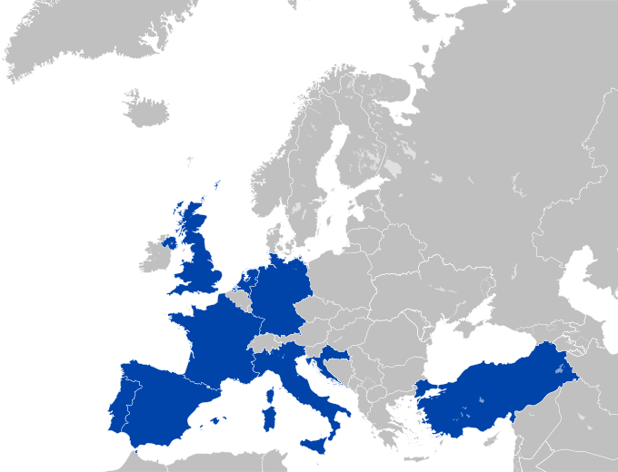



## Basic information

The workshop will take place during **05-06 June 2023** at [ESSEC Business School](https://www.essec.edu/), in **Cergy, France**, a suburb of Paris.

To ensure an atmosphere of conviviality, we are only able to accept **40 participants**.
Registrations will be processed on a first-come first-serve basis, will be confirmed upon paying a small inscription fee of **100€**, and includes:

* Accommodation for two nights in shared apartments (each apartment accommodates up to six people in single beds).
* Social activities (more info soon).
* Social dinner in Pontoise, a nearby village.
* Lunches and coffee breaks.

### About the Venue

ESSEC Business School is located at the following address:

3 Avenue Bernard Hirsch
95021 Cergy
France

It is easily reachable with suburban trains at stop *Cergy Prefecture*.
The trains serving the station are RER Line A and Transilien Line L.
ESSEC is also connected with a direct bus to Paris Charles de Gaulle Airport (CDG); the bus line is 9518 and departs from the airport bus station "Roissypole".

<iframe src="https://www.google.com/maps/embed?pb=!1m18!1m12!1m3!1d728.4412125850082!2d2.0767820730276454!3d49.033422567010156!2m3!1f0!2f0!3f0!3m2!1i1024!2i768!4f13.1!3m3!1m2!1s0x47e6f53ae44bd367%3A0xa3f3ee2330ea2664!2sESSEC%20Business%20School%20Cergy-Pontoise%20Campus!5e0!3m2!1sen!2ses!4v1674646738456!5m2!1sen!2ses" width="600" height="450" style="border:0;" allowfullscreen ></iframe>

### About the Dates

The workshop takes place on a Monday (05/06) and a Tuesday (06/06).
You are welcome to come a few days earlier, if you want to enjoy a weekend in Paris.

### Accommodation

All registered participants are offered free accommodation in shared rooms accommodating one, two or three six people (in individual beds).
The offered accommodation covers the night of 04-05 June and that of 05-06 June.
The host structures are [Cowool Aparthotel](https://www.cowool.co/cowool/cergy/) and [Ibis Cergy Le Port](https://all.accor.com/hotel/0928/index.en.shtml), both at a 12-minute walk from ESSEC Business School.

Please note that the registration fee includes two nights at the hotel, 04-06 June.
Participants who want to extend their stay at the same structure can get in touch with the hotel after receiving their registration confirmation.

### Participants home institutions

## Sponsors

We gratefully acknowledge the contribution of:

* [EURO](https://euro-online.org/)
* [ESSEC Business School](https://www.essec.edu/) via the ESSEC Research Centre ([CERESSEC](https://www.essec.edu/en/pages/faculty-and-research/research/support-for-research-our-priorities/))
* [DecisionBrain](https://decisionbrain.com/), a leading Optimisation and Machine Learning company based in Paris